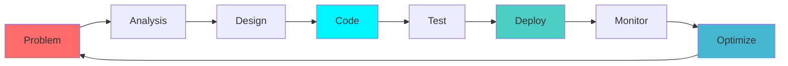

<div align="center">

# ⚡ AMAR PAL
## `< Full Stack Developer />` • `AI Enthusiast` • `Problem Solver`


</div>

---

## 🎯 **WHO AM I?**

```typescript
const AmarPal = {
    location: "Kolkata, West Bengal",
    education: "B.Tech CS with AI & ML",
    currentFocus: ["Full Stack Development", "AI Integration", "System Design"],
    workingOn: "Next-gen web applications with AI capabilities",
    learning: ["Advanced Algorithms", "Cloud Architecture", "DevOps"],
    funFact: "I debug with console.log and I'm not ashamed! 🐛",
    
    lifePhilosophy: "Code is poetry, algorithms are art, and bugs are just features in disguise ✨"
};
```

---

## 🛠️ **TECH ARSENAL**

<div align="center">

### **Frontend Mastery**


### **Backend Excellence**


### **AI & Languages**


### **Tools & DevOps**


</div>

---

## 🚀 **FEATURED PROJECTS**

<div align="center">

<table>
<tr>
<td width="50%" align="center">

### 🛍️ **E-Commerce Platform**


**Tech Stack:** `MERN` `Redux` `Stripe` `JWT`

A full-featured e-commerce platform with advanced cart management, secure payment processing, and admin analytics dashboard.

[](https://ecommerce-1-sur7.onrender.com/auth/login)
[](https://github.com/ITSAMARHERE/ECommerce-)

</td>
<td width="50%" align="center">

### 💬 **Talka - Task Manager**


**Tech Stack:** `React` `Node.js` `Socket.io` `MongoDB`

Real-time collaborative task management platform with live updates, progress tracking, and team coordination features.

[](https://talka.onrender.com/login)
[](https://github.com/ITSAMARHERE/Talka)

</td>
</tr>
<tr>
<td width="50%" align="center">

###  💬 **Mini-Linkeidn**


**Tech Stack:** `MERN` `JWT` `Bcrypt` `AES Encryption`

A full-stack LinkedIn clone built with the MERN stack, featuring real-time social networking capabilities, professional networking tools, and a modern responsive design.

[](https://mini-linkedin-frontend-enib.onrender.com/)
[](https://github.com/ITSAMARHERE/Mini_Linkedin)

</td>
<td width="50%" align="center">

### 💬 **SocialSphere - Community Forum**


**Tech Stack:** `React` `TypeScript` `Vite` `superBase` `TailwindCss`

A comprehensive social media platform where users can connect, share updates, upload photos, and engage in real-time conversations with friends and communities.

[](https://social-sphere-smoky.vercel.app/)
[](https://github.com/ITSAMARHERE/SocialSphere)

</td>
</tr>
</table>

</div>

---

## 📊 **GITHUB ANALYTICS**

<div align="center">


<table>
<tr>
<td width="50%">

</td>
<td width="50%">

</td>
</tr>
</table>


</div>

---

## 🌊 **CONTRIBUTION GRAPH**

<div align="center">

</div>

---

## 💡 **SKILL PROGRESSION**

<div align="center">



### **Current Learning Path**
- 🎯 **Advanced System Design** - Microservices & Distributed Systems
- 🚀 **Cloud Architecture** - AWS Solutions Architect
- 🤖 **AI Integration** - LangChain & Vector Databases
- 📱 **Mobile Development** - React Native

</div>

---

## 🌟 **ACHIEVEMENTS & CERTIFICATIONS**

<div align="center">

| 🏆 Achievement | 📅 Year | 🎯 Skills |
|:---:|:---:|:---:|
| Full Stack Web Development | 2023 | MERN Stack |
| AI & Machine Learning | 2024 | Python, TensorFlow |
| Cloud Computing Fundamentals | 2024 | AWS, Docker |
| Data Structures & Algorithms | 2023 | Problem Solving |

</div>

---

## 🤝 **LET'S CONNECT & COLLABORATE**

<div align="center">


### **Find Me Around the Web** 🌐

[](https://www.linkedin.com/in/amar-pal-a945ba250/)
[](mailto:tmsl.aiml.amarpal@gmail.com)
[](https://www.instagram.com/its.amarhere/?hl=en)
[](https://github.com/ITSAMARHERE)

### **🚀 Open to Opportunities**
- 💼 Full Stack Development Projects
- 🎓 Mentoring & Knowledge Sharing  
- 🤝 Open Source Contributions
- 💡 Innovative Startup Ideas

---


### 💭 **Philosophy**

> *"Code is not just about solving problems, it's about creating possibilities. Every line of code is a step towards building a better digital future."*

---


**⚡ Thanks for visiting! Let's build something amazing together! ⚡**

</div>
